# PromptForge Frontend / Console Architecture

## Modeling assumptions
- Directly evidenced current structures: the console is a browser-based operator surface, most reads hydrate through `/console/bootstrap`, mutations already exist for several admin actions, and the backend is the canonical state holder.
- Minimally inferred from backend console capabilities: a modular admin console split into setup, configuration, review, operations, observability, and assist workflows.
- Future-state elements: stronger authN/authZ, richer realtime sync, safer destructive-action UX, and multi-operator readiness. These are proposed only unless explicitly implemented.

## 1. Frontend System Context Diagram

**CURRENT STATE**

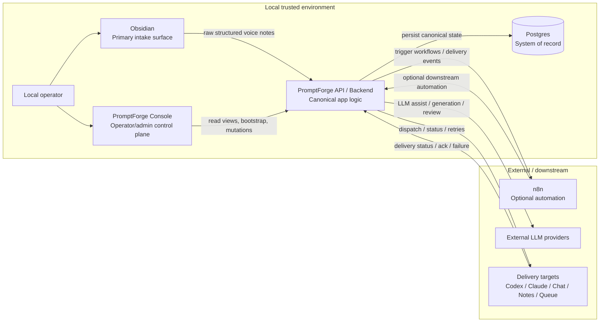

**GAPS**
- Obsidian is the intake truth, but console UX can still look like it owns workflow truth if lineage labels are vague.
- Delivery targets are not all necessarily executable live targets yet.
- LLM assist and downstream automation must remain visibly backend-controlled, not UI-implied.

**FUTURE STATE**
- The console remains a control plane only, with clearer separation between intake, generation, delivery, and automation.
- Live target capabilities are explicit per target type and failure mode.

**What this shows**
- The console is not the primary intake surface.
- Postgres and backend orchestration own truth.

---

## 2. Frontend Container / Runtime Diagram

**CURRENT STATE**

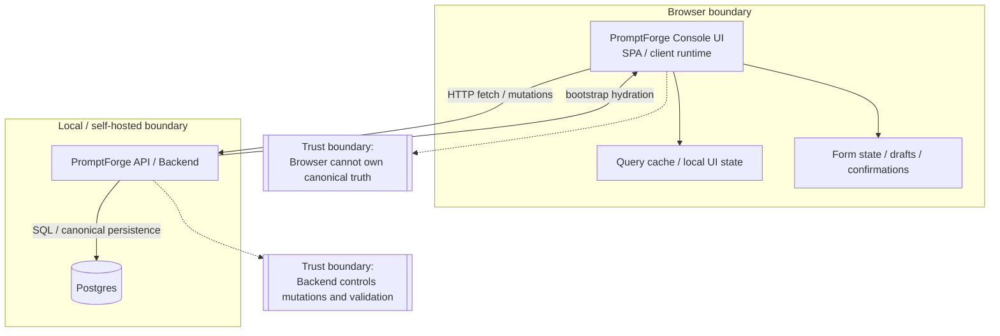

**GAPS**
- Current browser runtime still needs to avoid any implied source-of-truth behavior.
- Hosted preview can drift toward fallback paths if API routing is weak.

**FUTURE STATE**
- The frontend can stay a thin SPA, or be server-served by the backend, but the trust boundary stays the same.
- Query cache and optimistic state remain temporary only.

**What this shows**
- Browser state is temporary.
- Backend and Postgres remain canonical.

---

## 3. Frontend Module / Component Architecture Diagram

**CURRENT STATE**

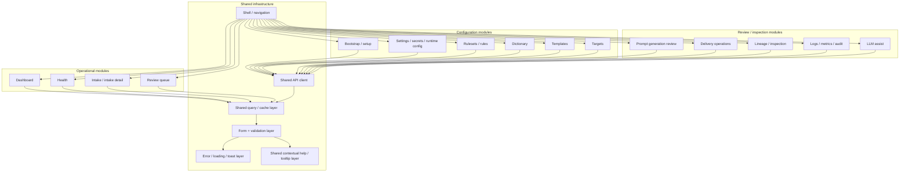

**GAPS**
- Shared help and shared error handling need to stay consistent across all screens.
- Operational, configuration, and inspection surfaces must not collapse into one generic CRUD pattern.

**FUTURE STATE**
- Deeper submodules per domain can emerge, but the top-level split should remain stable.
- Shared infrastructure should stay centralized to prevent drift in validation, help, and mutation handling.

**What this shows**
- The console is domain-sliced, not feature-sliced by generic widgets.
- Shared infrastructure should be reused everywhere.

---

## 4. Screen Map / Information Architecture Diagram

**CURRENT STATE**

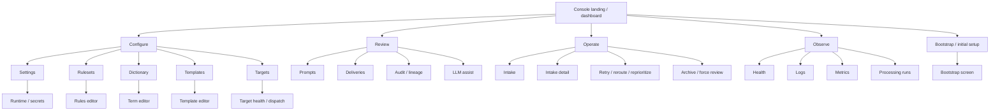

**GAPS**
- Navigation should make operator workflows obvious, not force users to infer them from page names.
- Some screens are still partly inventory views instead of fully operational surfaces.

**FUTURE STATE**
- Each top-level group becomes a stable operator journey.
- Screen grouping should mirror the backend lifecycle: intake, generation, delivery, observation, recovery.

**What this shows**
- The console should read like an operator map.
- Page grouping should follow workflow, not implementation artifact.

---

## 5. Data Flow Diagram (Frontend ↔ Backend)

**CURRENT STATE**

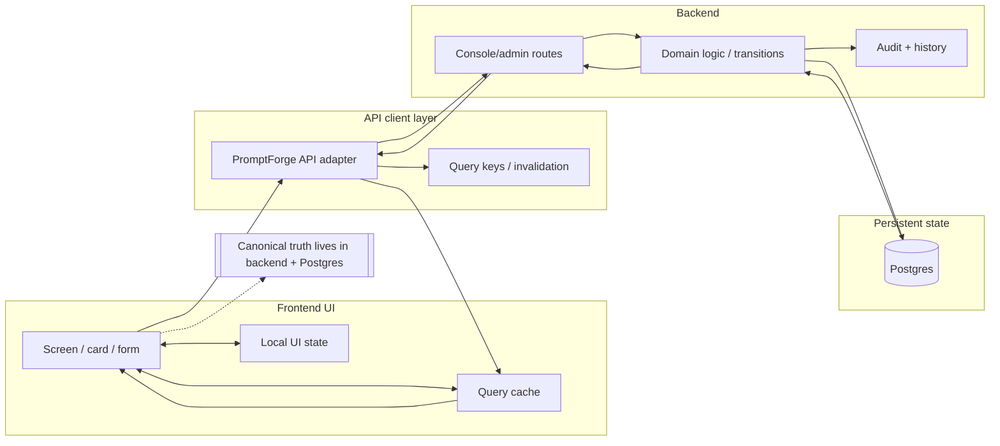

**GAPS**
- Mutations must never be treated as successful if the backend rejects or cannot persist them.
- Snapshot/bootstrap data should not outlive a successful refetch.

**FUTURE STATE**
- More reads should come from dedicated backend routes instead of bootstrap-derived client synthesis.
- Mutations should emit consistent invalidation behavior and explicit failure state.

**What this shows**
- The frontend is a client of canonical backend state.
- Backend-controlled transitions own data integrity.

---

## 6. Sequence Diagrams

### 6.1 Bootstrap / Initial Setup Flow

**CURRENT STATE**

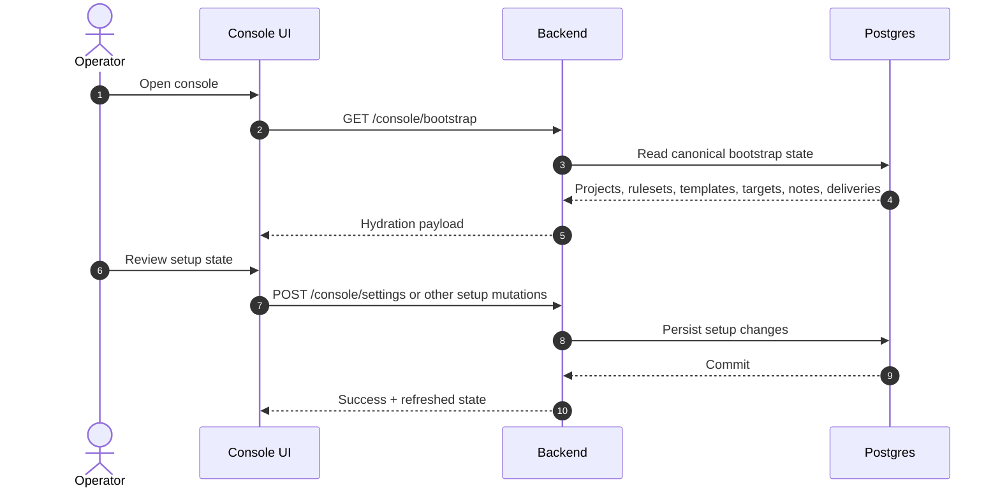

**GAPS**
- Setup must not imply the console creates the workflow engine.
- Unsupported setup fields should fail explicitly.

**FUTURE STATE**
- Setup may include stronger validation and clearer first-run guidance.

**What this shows**
- Bootstrap is a hydration step, not a source of truth.
- Setup mutations flow through backend persistence.

### 6.2 Rules / Template Edit Flow

**CURRENT STATE**

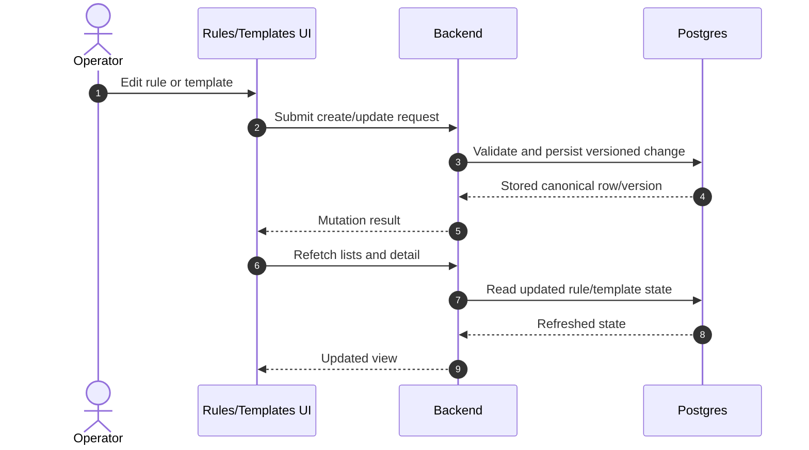

**GAPS**
- Local-only draft behavior should not masquerade as persistence.
- Versioning, precedence, and activation semantics must remain transparent.

**FUTURE STATE**
- Editor can show diff-aware previews, validation hints, and safer commit flows.

**What this shows**
- Rule and template edits must be canonical backend mutations.

### 6.3 Prompt Review Flow

**CURRENT STATE**

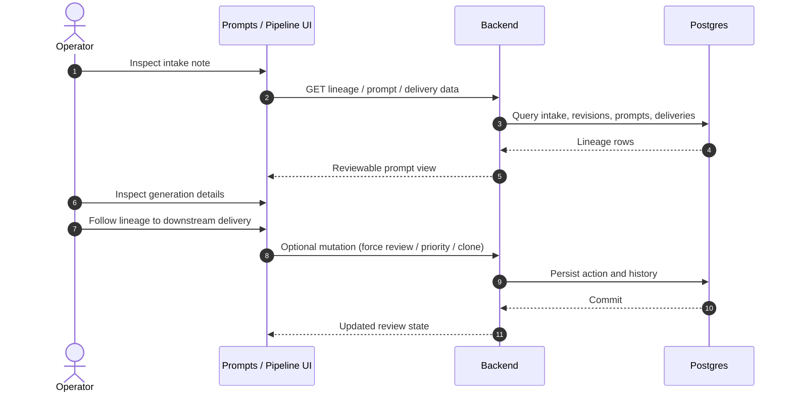

**GAPS**
- The UI must distinguish synthesized lineage from complete backend lineage.
- Missing hops and partial lineages should be obvious.

**FUTURE STATE**
- Richer inspection can include diff, provenance, and validation overlays.

**What this shows**
- Prompt review is an inspection workflow, not an intake workflow.

### 6.4 Delivery Operations Flow

**CURRENT STATE**

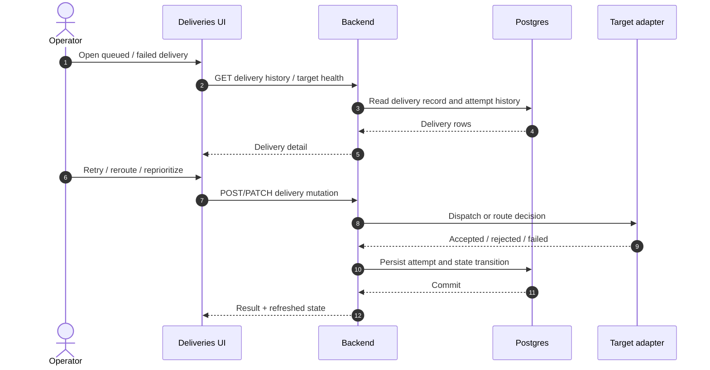

**GAPS**
- Delivery actions must never be shown as consumer-style buttons.
- Unsupported target types should fail visibly and explicitly.

**FUTURE STATE**
- Delivery UI can show richer target diagnostics and live attempt progress.

**What this shows**
- Delivery lifecycle is separate from prompt generation lifecycle.

### 6.5 Logs / Metrics Inspection Flow

**CURRENT STATE**

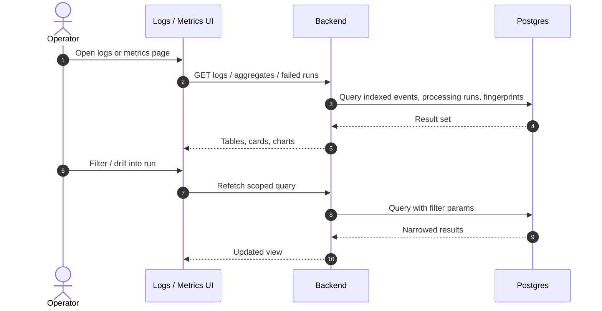

**GAPS**
- Observability UX should separate signals from raw dumps.
- Filter, drilldown, and error fingerprint semantics must stay stable.

**FUTURE STATE**
- More direct traceability from logs to lineage and delivery history.

**What this shows**
- Observability is read-centric but still backend-canonical.

### 6.6 LLM Assist Flow

**CURRENT STATE**

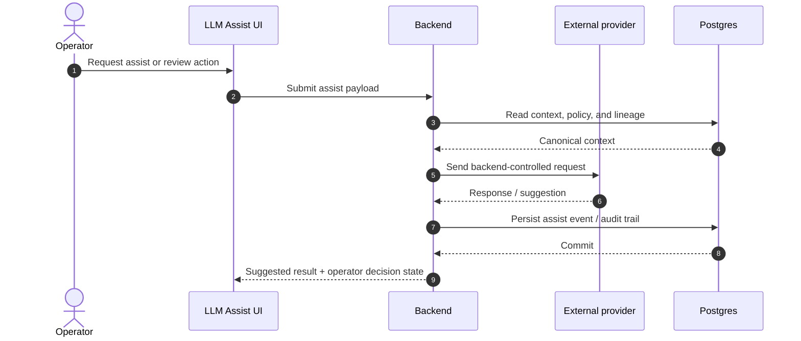

**GAPS**
- The browser must not talk directly to providers as if it owns policy.
- Assist outcomes should be reviewable and auditable.

**FUTURE STATE**
- Assist may become more structured with stronger approval and provenance UX.

**What this shows**
- LLM interactions are backend-controlled operator tools.

### 6.7 Error Recovery Flow

**CURRENT STATE**

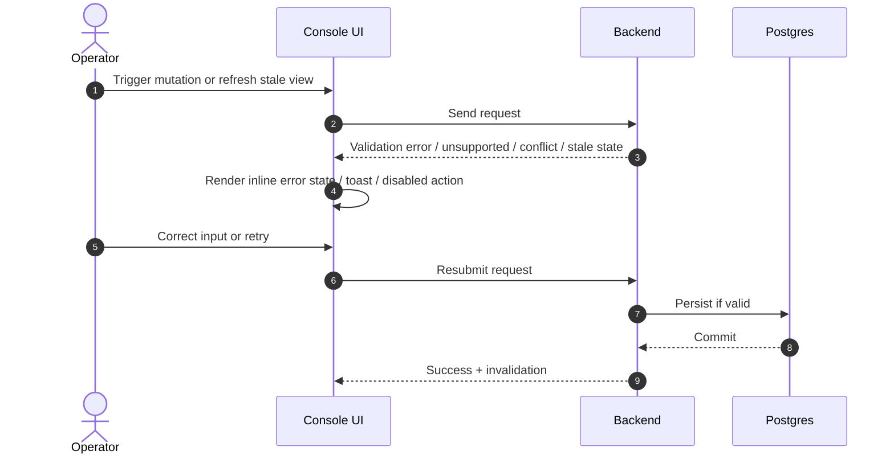

**GAPS**
- Error states must distinguish unsupported, stale, unauthorized, and failed persistence.
- The frontend must not invent success when the backend says no.

**FUTURE STATE**
- Recovery UX can become more guided with conflict resolution and safer confirmations.

**What this shows**
- Error handling is a first-class operator workflow.

---

## 7. Frontend State Management Diagram

**CURRENT STATE**

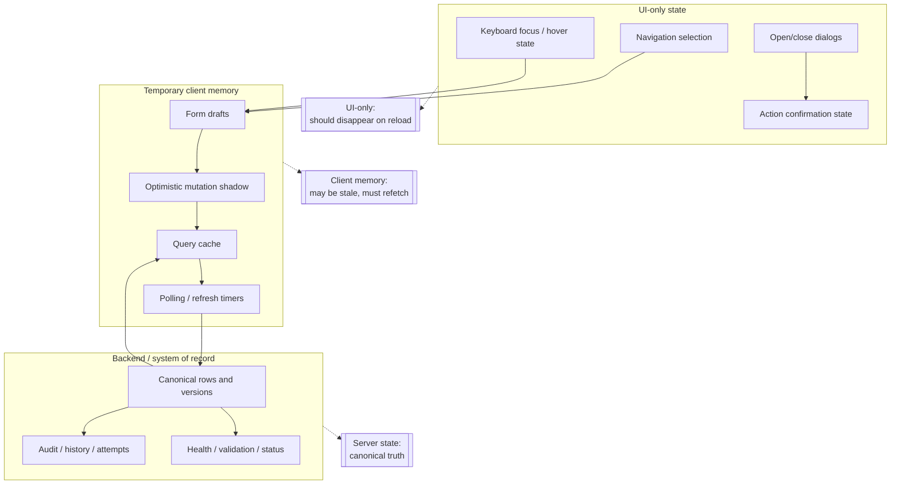

**GAPS**
- Optimistic state must be used sparingly and always reconciled.
- Backend truth should invalidate client state after mutations.

**FUTURE STATE**
- More selective cache invalidation and explicit stale-state indicators.

**What this shows**
- Browser memory is temporary.
- Workflow truth stays in backend state.

---

## 8. Trust Boundary / Security Diagram

**CURRENT STATE**

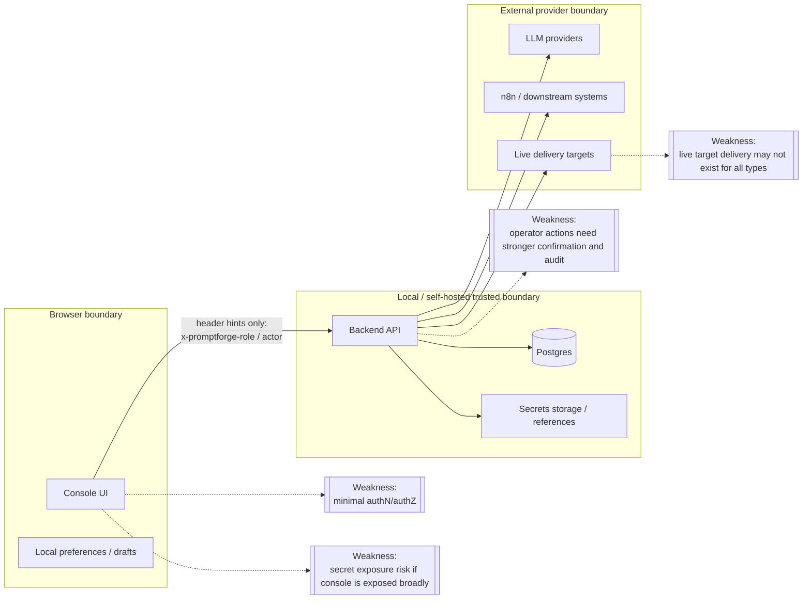

**GAPS**
- Header-only role hints are not production-grade authorization.
- Secrets and privileged actions need explicit, hardened treatment.
- Exposing the console outside trusted local/self-hosted use is risky.

**FUTURE STATE**
- Real authN/authZ, better secret handling, and safer admin workflows.

**What this shows**
- The browser is the least trusted layer.
- External systems must be isolated behind backend policy.

---

## 9. Gap Analysis Diagram

**CURRENT STATE**

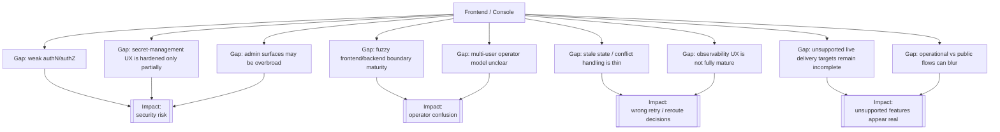

**GAPS**
- These are not cosmetic issues; they affect operator safety and correctness.

**FUTURE STATE**
- Each gap should either be closed by backend capability or made explicit in the UI.

**What this shows**
- The console still has safety and clarity gaps that must be visible, not hidden.

---

## 10. Current-State vs Future-State Console Architecture Diagram

**CURRENT STATE**

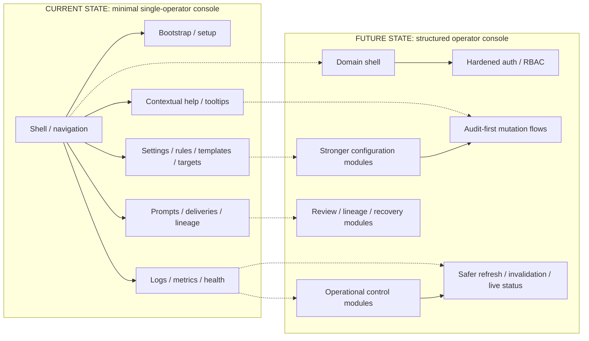

**GAPS**
- Current console is still closer to an operational MVP than a hardened admin surface.
- Security, auditability, and live-state quality need more structure.

**FUTURE STATE**
- Domain modules become more explicit and safer.
- The console becomes more maintainable without pretending to be SaaS-grade.

**What this shows**
- The console evolves by hardening operator flows, not by turning into a public app.

---

## 11. Frontend Deployment / Serving Diagram

**CURRENT STATE**

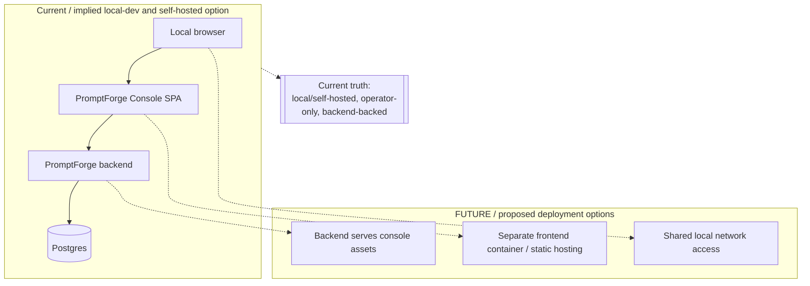

**GAPS**
- Preview and deployment routing must not fall back to localhost assumptions.
- Serving model should be explicit so the browser always knows which backend is authoritative.

**FUTURE STATE**
- The console can be served by the backend or separately, but contract routing stays stable.

**What this shows**
- The app should work in a local/self-hosted topology first.
- Serving strategy is secondary to backend correctness.

---

## 12. Operator Workflow Diagram

**CURRENT STATE**

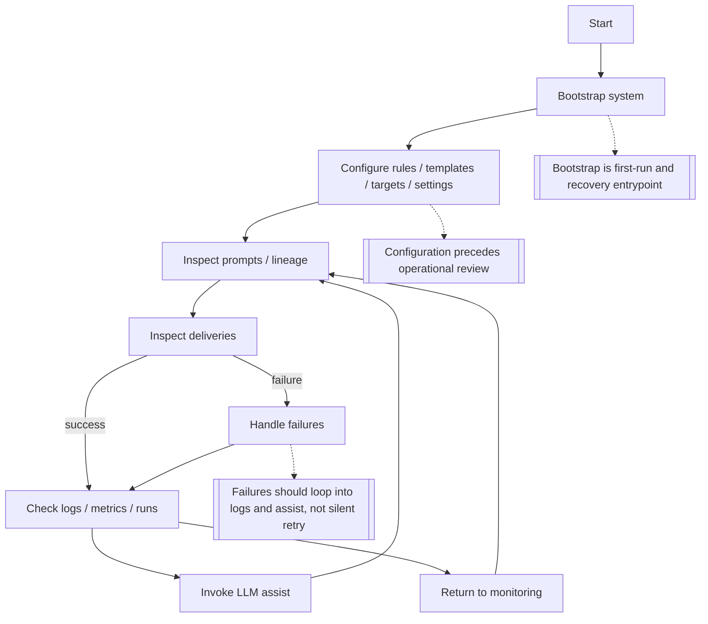

**GAPS**
- The workflow must remain linear enough for operators to understand, but flexible enough for recovery.
- Silent state changes break the workflow model.

**FUTURE STATE**
- More explicit decision points for retry, reroute, archive, and escalation.

**What this shows**
- The console should support a clear operator loop from setup to recovery.

